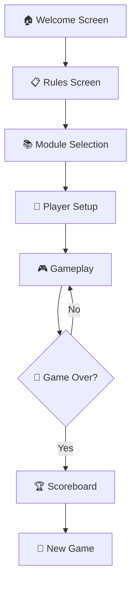

# 🐍🪜 EduLadder Quest
### *Rise Above the Snakes, Aim for the Ladders!*

<div align="center">


**🎮 Experience the next-generation twist on the classic board game! 🎯**

*EduLadder Quest combines the excitement of snakes and ladders with challenging educational questions to test your knowledge. Get ready to climb up with ladders, slide down with snakes, and boost your score by answering questions correctly!*

[](https://piyushiitk24.github.io/EduLadder/)
[](https://github.com/piyushiitk24/EduLadder)
[](https://github.com/piyushiitk24)

---

</div>

## 📋 Table of Contents

- [🎯 About The Project](#-about-the-project)
- [✨ Features](#-features)
- [🛠️ Technologies Used](#️-technologies-used)
- [🎮 How to Play](#-how-to-play)
- [🎲 Game Flow](#-game-flow)
- [🚀 Getting Started](#-getting-started)
- [📸 Screenshots](#-screenshots)
- [🔧 Development Journey](#-development-journey)
- [🎯 Future Enhancements](#-future-enhancements)
- [🤝 Contributing](#-contributing)
- [👨‍💻 About the Developer](#-about-the-developer)
- [📄 License](#-license)

---

## 🎯 About The Project

**EduLadder Quest** transforms the timeless board game experience into an engaging digital educational quest. Designed for 2 to 4 players, this game seamlessly blends the classic mechanics of snakes and ladders with knowledge challenges that not only determine your fate on the board but also help you learn along the way.

### 🌟 What Makes It Special?

- **🎓 Educational Integration**: Questions from 8 different learning modules
- **🎨 Modern UI/UX**: Neumorphism and Claymorphic design elements
- **🎵 Immersive Experience**: Interactive sound effects and smooth animations
- **📱 Responsive Design**: Works perfectly on all devices
- **🏆 Comprehensive Scoring**: Detailed performance analytics

---

## ✨ Features

### 🎮 Core Gameplay Features
- **👥 Multiplayer Support**: 2-4 players with custom avatars
- **🎲 Interactive Dice Rolling**: Smooth animations and sound effects
- **🪜 Classic Mechanics**: Traditional snakes and ladders with educational twists
- **❓ Knowledge Challenges**: Questions triggered by game events
- **🏅 Real-time Scoring**: Track progress throughout the game

### 🎨 Design & Experience
- **🌈 Vibrant UI**: Colorful, modern interface with glass-like elements
- **🎭 Avatar Customization**: Choose from 8 unique player avatars
- **🔊 Audio Feedback**: Immersive sound effects for every action
- **📱 Responsive Layout**: Optimized for desktop, tablet, and mobile
- **⚡ Smooth Animations**: CSS-powered transitions and effects

### 📚 Educational Modules
Choose from 8 comprehensive learning topics:
1. **🎯 Teaching Learning Process**
2. **🧠 Learning Theories**
3. **📖 4 Ways of Learning**
4. **👨‍🎓 Andragogy**
5. **⚙️ Systematic Approach to Training (SAT)**
6. **📐 Basic Teaching Model**
7. **🎭 Domains of Learning**
8. **✍️ Writing Objectives**

---

## 🛠️ Technologies Used

<div align="center">


</div>

### 🎨 Design Techniques
- **Neumorphism**: Soft, extruded UI elements
- **Claymorphism**: Glass-like transparency effects
- **CSS Grid & Flexbox**: Modern layout systems
- **CSS Animations**: Smooth transitions and effects
- **Responsive Design**: Mobile-first approach

---

## 🎮 How to Play

### 🚀 Getting Started
1. **🎲 Roll to Begin**: Players must roll a `1` to start OR answer a question correctly
2. **🎯 Choose Module**: Select your preferred learning topic
3. **👥 Add Players**: Set up 2-4 players with custom names and avatars
4. **🎮 Start Playing**: Take turns rolling dice and moving around the board

### 🎯 Game Rules

#### 🎲 **Starting the Game**
- Roll a **1** to begin moving
- If you roll any other number, answer a question:
  - ✅ **Correct Answer** → Start immediately + bonus turn
  - ❌ **Wrong Answer** → Turn passes to next player

#### 🪜 **Gameplay Mechanics**
- **🎲 Dice Roll**: Determines movement distance
- **🪜 Ladders**: Automatically climb up when landed on
- **🐍 Snakes**: Trigger questions with consequences:
  - ✅ **Correct** → Move forward +2 (Bonus!)
  - ❌ **Wrong** → Slide down to snake's tail (Penalty)

#### ⭐ **Bonus Questions**
- **❓ Question Tiles**: Random knowledge challenges
  - ✅ **Correct** → +2 forward, +1 if on snake
  - ❌ **Wrong** → -2 backward, -1 if on ladder

#### 🏆 **Winning**
- First player to reach tile **100** wins! 🎉
- Overshooting tile 100? Wait for your next turn!

---

## 🎲 Game Flow



---

## 🚀 Getting Started

### 🎯 Play Online (Easiest Way)
Just click the link and start playing immediately!
**👉 [Play EduLadder Quest Now!](https://piyushiitk24.github.io/EduLadder/)**

### 💻 Run Locally

1. **Clone the repository**
   ```bash
   git clone https://github.com/piyushiitk24/EduLadder.git
   ```

2. **Navigate to project directory**
   ```bash
   cd EduLadder
   ```

3. **Open in browser**
   ```bash
   # Using Python (if installed)
   python -m http.server 8000
   
   # Or simply open index.html in your browser
   open index.html
   ```

4. **Start Playing!** 🎮

### 📁 Project Structure
```
EduLadder/
├── 📄 index.html          # Main game file
├── 🎨 style.css           # Styling and animations
├── ⚡ script.js           # Game logic and interactions
├── 🖼️ images/             # Game assets
│   ├── 🎮 board.png       # Game board
│   ├── 👤 avatars/        # Player avatars
│   └── 📚 modules/        # Learning module icons
├── 🔊 audio/              # Sound effects
└── 📖 README.md           # Project documentation
```

---

## 📸 Screenshots

<div align="center">

### 🏠 Welcome Screen
*Beautiful welcome interface with animated logo*

### 📋 Rules Screen
*Comprehensive game rules and instructions*

### 📚 Module Selection
*Choose from 8 educational topics with stunning UI*

### 🎮 Gameplay
*Interactive board with real-time player tracking*

</div>

---

## 🔧 Development Journey

### 💡 **Challenges Overcome**
- **🎯 Smooth Avatar Movement**: Implemented CSS animations and transitions for fluid player piece movement
- **🔊 Audio Synchronization**: Perfectly timed audio cues with JavaScript events
- **📱 Responsive Design**: Used advanced CSS Grid and Flexbox for seamless cross-device experience
- **🎨 UI/UX Design**: Created modern Neumorphism and Claymorphism effects

### 🛠️ **Technical Highlights**
- **Pure Vanilla JavaScript**: No frameworks, just clean and efficient code
- **CSS Animations**: Custom keyframes for engaging visual effects
- **Modular Architecture**: Well-organized code structure for easy maintenance
- **Performance Optimized**: Smooth gameplay even on slower devices

---

## 🎯 Future Enhancements

- [ ] 💾 **Save & Resume**: Implement game state persistence
- [ ] 🎭 **Avatar Expansion**: More customization options and accessories
- [ ] 🏆 **Global Leaderboard**: Competitive multiplayer rankings
- [ ] 🎨 **Theme Variants**: Multiple board designs and color schemes
- [ ] 🎓 **Tutorial Mode**: Interactive guided learning for beginners
- [ ] 🌐 **Multiplayer Online**: Real-time online gameplay
- [ ] 📊 **Advanced Analytics**: Detailed learning progress tracking
- [ ] 🔊 **Sound Customization**: Music and sound effect options

---

## 🤝 Contributing

Contributions are what make the open source community such an amazing place to learn, inspire, and create. Any contributions you make are **greatly appreciated**.

### 🚀 How to Contribute

1. **Fork the Project**
2. **Create your Feature Branch** (`git checkout -b feature/AmazingFeature`)
3. **Commit your Changes** (`git commit -m 'Add some AmazingFeature'`)
4. **Push to the Branch** (`git push origin feature/AmazingFeature`)
5. **Open a Pull Request**

### 🐛 Found a Bug?
Please open an issue with detailed information about the bug and steps to reproduce it.

### 💡 Have an Idea?
Feel free to open an issue to discuss new features or improvements!

---

## 👨‍💻 About the Developer

<div align="center">

### **Piyush Tiwari**
*Full Stack Developer & UI/UX Enthusiast*

[](https://github.com/piyushiitk24)
[](mailto:piyushiitk24@gmail.com)

</div>

**🎯 Passionate about creating engaging, educational experiences through interactive web applications.**

- 🔭 Currently working on innovative educational gaming solutions
- 🌱 Always learning new technologies and design trends
- 💡 Love combining education with entertainment
- 🎨 Enthusiast of modern UI/UX design principles
- 🎮 Believer in the power of gamified learning

### 🛠️ **Tech Stack & Interests**
- **Frontend**: HTML5, CSS3, JavaScript, React
- **Design**: Neumorphism, Claymorphism, Responsive Design
- **Focus Areas**: Educational Technology, Game Development, UI/UX
- **Philosophy**: "*Learning should be fun, engaging, and accessible to everyone*"

---

## 📄 License

This project is open source and available under the [MIT License](LICENSE).

---

<div align="center">

### 🌟 **Star this repository if you found it helpful!** ⭐

**Made with ❤️ by [Piyush Tiwari](https://github.com/piyushiitk24)**

*"Rise Above the Snakes, Aim for the Ladders!"* 🐍🪜

---

**🎮 [Play Now](https://piyushiitk24.github.io/EduLadder/) | 🔧 [Report Bug](https://github.com/piyushiitk24/EduLadder/issues) | 💡 [Request Feature](https://github.com/piyushiitk24/EduLadder/issues)**

</div>